# QuadrantSignal 2.0
---

##### View this presentation with Microsoft Sway:
https://sway.office.com/Pt1B6rGjZaSRXch8?ref=Link

---

QuadrantSignal is an automated email alert service for stock trading signals based on revenue growth and revenue acceleration. The trade signals are generated using a Python script that we deployed in a serverless model with AWS to send daily emails. The QuandrantSignals delivered in each email are based on the revenue analysis we began in [ValuationVisualization](https://github.com/marshallwolfe/ValuationVisualization) and we continue to work towards further validating with ongoing quantitative analyses.

Following the initial launch of [QuadrantSignal](https://github.com/marshallwolfe/QuadrantSignal_Public), we quickly identified areas for improvement and started to gather feedback from subscribers to enhance our offering. Below we detail the improvements and new features for the latest deployment of QuadrantSignal and, we present our latest supporting analyses for utilizing QuadrantSignal.

### The Directional Compass:

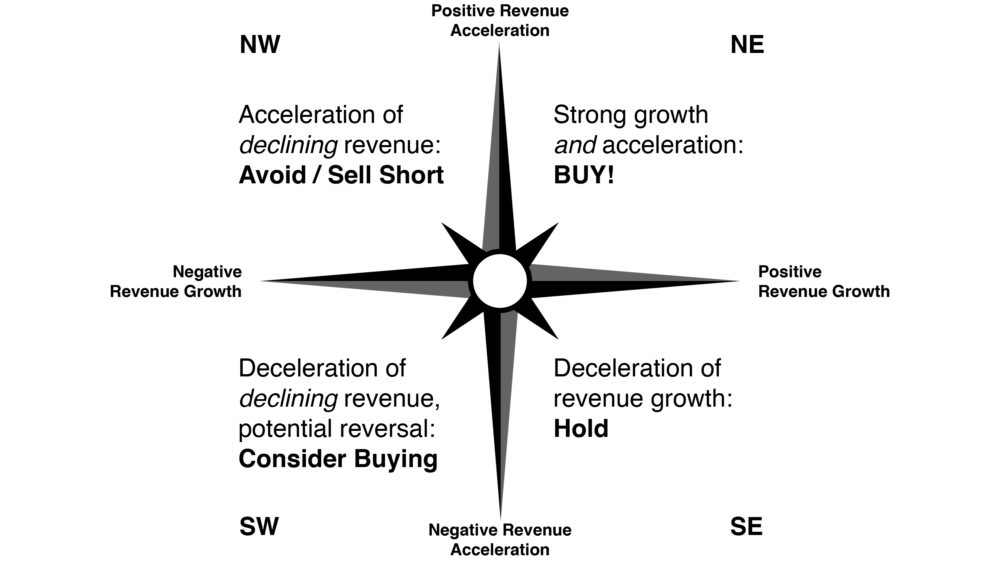

## What we did

To build in enhancements and enable new features we had three primary goals:
1)  **Swap APIs** for more reliable and higher quality data
2)  **Switch from Amazon SNS to Amazon SES** to enable HTML-formatted emails
3)  **Store signals and associated data** for future backtesting and proof of performance

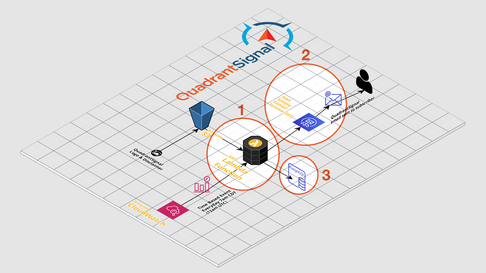

### Upgrading APIs

*The Problems:*
* **Yahoo Earnings Calendar Scraper API** scrapes the Yahoo Earnings Calendar page as it exists at the time the code is run. This web page, however, updates overnight following the earnings date. Fewer tickers appear on this page the following day, and as a result calling the API returns a shorter list of tickers often missing big name companies. 
* **Financial Modeling Prep API** exhibits unsatisfactory data quality as well as an unreliable income statement data update schedule. Learning a good number of companies announce earnings with an 8-K form rather than a 10-Q we discovered this impacted the timing in which the API would update income statement data. Unfortunately, Financial Modeling Prep was neither quick enough nor reliable enough for our application.

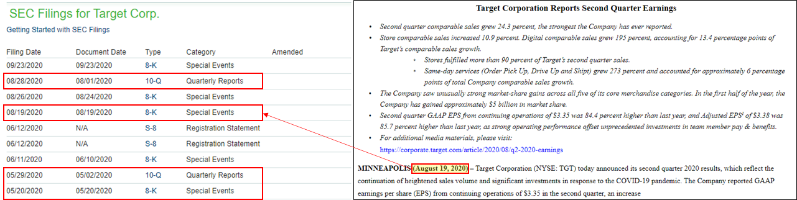

*The Solutions:*
* **Financial Modeling Prep Earnings API** allows us to get a consistent set of company tickers for each earnings date, but also capture the previous two days of companies announcing earnings. The two-day window is to address the lag time for the IEX API to update when a company reports earnings with a Form 8-K. Using an f-string and custom date functions, we are able to call the precise date range with Python each day.
* **IEX Cloud** addresses the data quality and timeliness concerns, so we switched our income statement data to be called therefrom.

*The Results:*
* **A more complete list of tickers** for each earnings date is run through the QuadrantSignal generator code. 
* **Certainty that high profile companies** are included in our emails.
* **Two days worth of tickers in each email** in order to make sure QuadrantSignals have been delivered for companies announcing quarterly earnings initially with 8-K filings.

### Improving our User Experience

We switched from Amazon SNS (Simple Notification Service) to Amazon SES (Simple Email Service) to allow the sending of HTML-formatted emails. Additionally, we added functionality to generate both text-only and HTML-formatted emails, for proper rendering on each end user's platform.

*HTML-formatted Emails:*
* Exhibit tabular formatting to visually organize Ticker, Signal, and Earnings Date for each ticker 
* Feature hyperlinks from each ticker to its quote page on Yahoo Finance
* Contain an embedded footer image with our logo and legal disclaimer
* Include an "unsubscribe" email hyperlink that auto-populates the message Recipient (quadrantsignal@gmail.com), the Subject line (UNSUBSCRIBE), and the message Body ("I wish to unsubscribe from these emails. Thank you!") for user-friendliness

*Text-only Emails:*
* Provide Earnings Date, Ticker, and Signal in a plain text format
* Include text-based legal disclaimer
* Important for accessibility

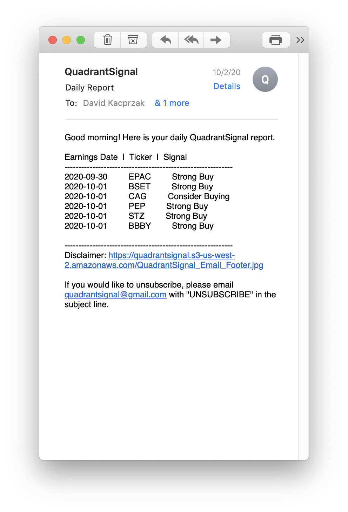

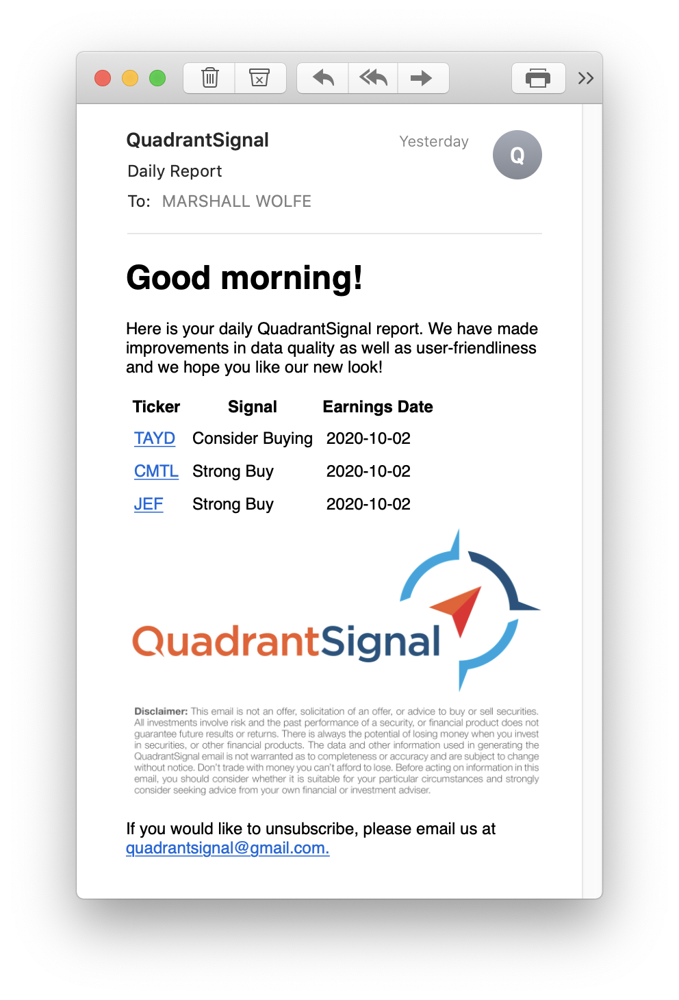

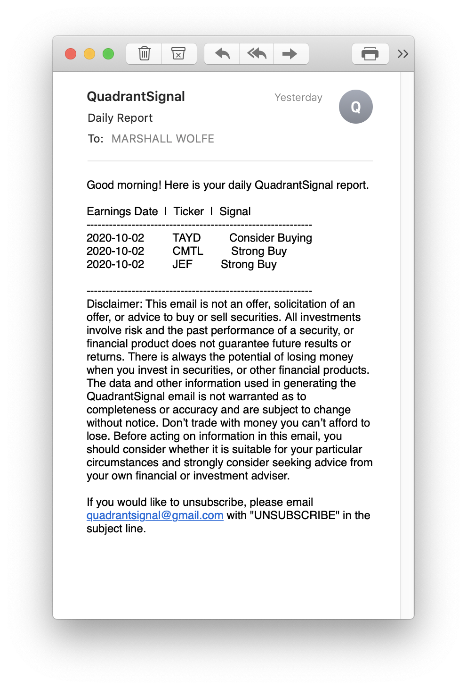

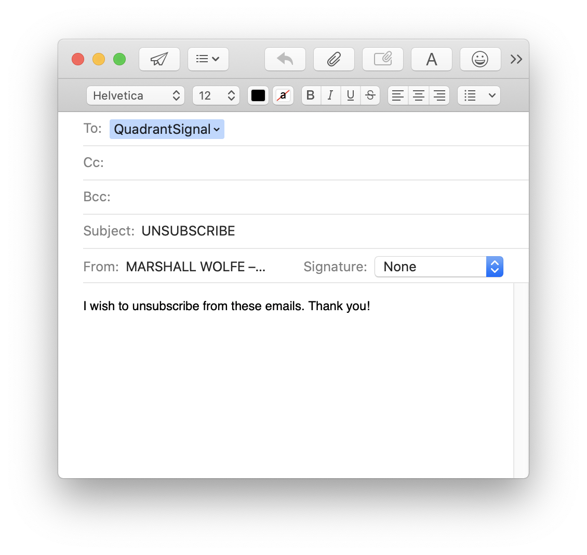

### Storing Our Data

In order to conduct backtesting that accurately reflects the timing of signals delivered via email, we have worked to capture revenue data, our calculated data points, signals, and key dates into our own database. To do this we set up a PostgresSQL database. Utilizing the SQLAlchemy library we are able to write to the SQL database using Python. Simply, we declare the table name we want to write and/or append to and send our final DataFrame using the `to_sql` function.

##### PostgresSQL Database

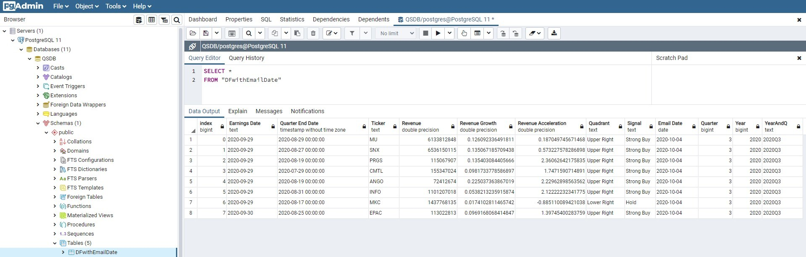

Currently we run this as a local server. Our goal is to build this out in a serverless computing model. Considerations include Amazon Relational Database Service (RDS), Google Cloud SQL for PostgreSQL, or Amazon DynamoDB. DynamoDB would be a departure from SQL to a NoSQL Key-Value Database.

##### SQL Query of QuadrantSignal DataFrame

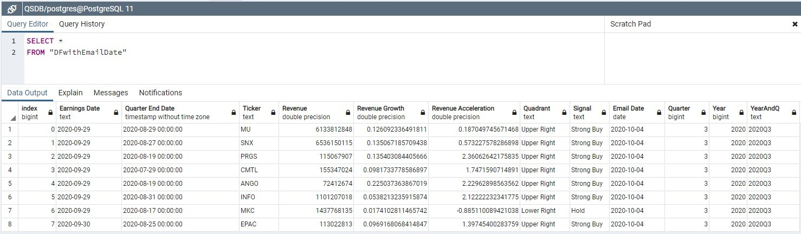

The goal is to produce performance charts like this:

##### Excess Return Above DJI (YoY) Backtest

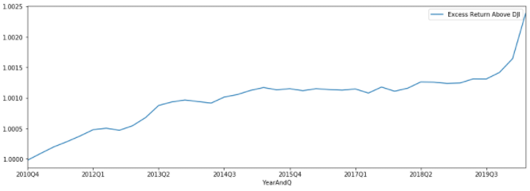

## Supporting Analysis

### Clarifying Year-over-Year (YoY) and Consecutive Quarter Analysis

In our ValuationVisualization project we identified trends that were potentially indicative of stock outperformance based on annual data. For QuandrantSignal 1.0 we increased the frequency to quarterly periods and calculated the excess return of our QuadrantSignal methodology over the (Dow Jones Industrial Average) market performance. The returns were outstanding and a near perfect reflection of our Directional Compass. In the transition from an annual to quarterly time frame we have discovered an important nuance of *year-over-year (YoY)* vs. *consecutive quarter (QoQ)* analysis. 

##### Excess Return Above DJI (YoY)

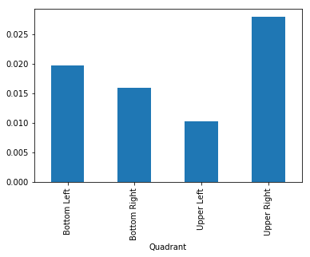

The excess returns produced in our first presentation of QuadrantSignal, shown in the Excess Return Above DJI (YoY) chart, were based on YoY changes in revenue. The great news is that our current deployment is operating on YoY quarterly data analysis. 

##### Following Quarter Return (YoY)

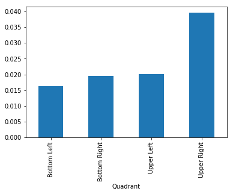

ValuationVisualization is by default a consecutive period analysis operating on an annual time frame and the first deployment of QuadrantSignal calculated on consecutive periods for signal generation. Generating signals based on consecutive quarters, however, does not produce the same returns as the quarterly YoY analysis. We conducted the corollary analysis shown in the Excess Return Above DJI (QoQ) chart. This did not match our hypothesized Directional Compass. 

##### Excess Return Above DJI (QoQ)

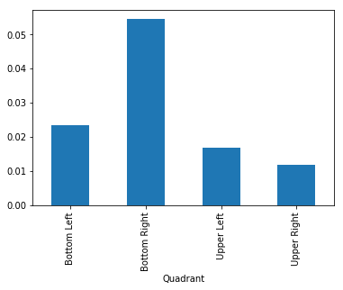

We speculate the high performance of the Bottom Right quadrant in this analysis is because they are Hold signals following a Strong Buy quarter. A company cannot reach the Bottom Right quadrant without passing through the Upper Right quadrant first. Since revenue is growing but not accelerating the company had to previously post revenue acceleration. That translates to continued revenue growth following a previous acceleration in growth. We believe this signals continued strength and momentum for the underlying business's top line growth.

##### Following Quarter Return (QoQ)

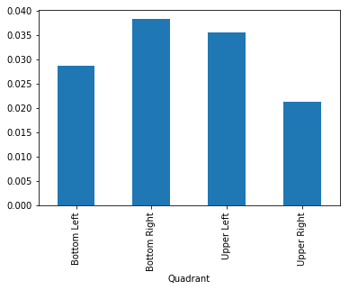

### Unlocking New Discoveries

With multiple analyses running in tandem we are happy to introduce the **QuadrantSignal Super Signal!** Super Signal combinations will be part our next undertaking of quantitative analysis in supporting the QuadrantSignal trading methodology. For example, "Strong Buy + Strong Buy" or "Strong Buy + Hold" are two combinations we are interested in investigating the returns vs. the market and which combination outperforms the other. We believe the Super Signals are an exciting future feature to boost confidence and performance of your trades!

Another exciting frontier for research and an opportunity to innovate exists in macroeconomic analysis using the QuandrantSignal data we are storing. Could registering a high number of Strong Buy signals be and indicator of a bull market to come? We don't know yet but, we are thrilled to be equipped with our Northwestern FinTech skills (Python, SQL, Machine Learning, and AWS Cloud) to uncover the results of this quantitative research.

## Looking Forward

* **Store our API data and QuadrantSignals** moving forward in a serverless model for proof of performance and future backtesting
* **Expand backtesting ticker universe** beyond the Dow 30 to further validate the underlying hypothesis of our work
* **Show new tickers only** by removing tickers that were included in the previous day's email
* **Offer a premium subscription** with a "Super Signal" generated by YoY and QoQ signal combinations
* **Ideating real-time signal generation** i.e. ways to take action in real-time on earnings announcement dates
* **Create a front-end webpage** for subscription handling and as a content landing page
* If you would like to subscribe, please email us at **quadrantsignal@gmail.com!**

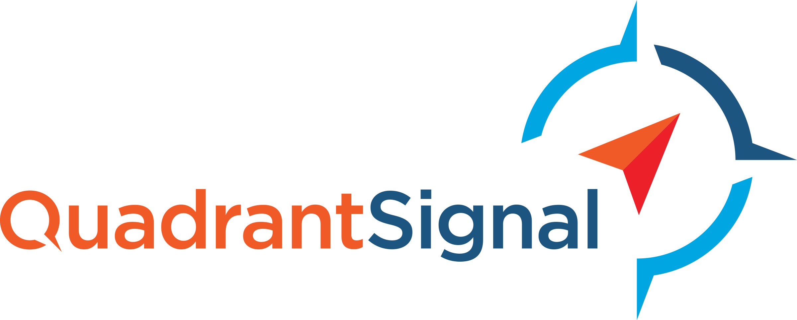